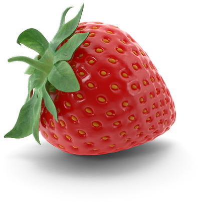

# developyn-autocrop
Small library for auto-cropping unwanted space out of an image while retaining shadows for PNG and JPEGs.

NPM: https://www.npmjs.com/package/developyn-autocrop

## Before


## After



## Example
```javascript
const { autocrop } = require('developyn-autocrop');

(async () => {
    await autocrop({
        input: './test1.png',
        output: './test1-autocropped.png',
        bgColor: {
            r: 255,
            g: 255,
            b: 255,
            a: 255
        }
    });
})();
```